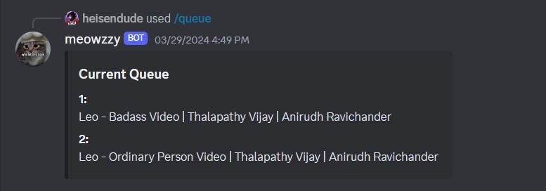
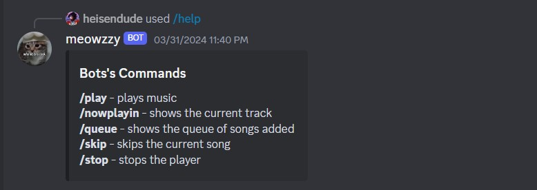

# Discord Music Bot

A simple Discord music bot written in Java using JDA (Java Discord API) and Lavaplayer. The bot allows users to play YouTube video music in Discord voice channels using various commands.

## Features

- Plays music from YouTube
- View the currently playing track
- View the music queue
- Skips the current track
- Stop playback
- Get help with available commands

## Setup

1. Clone this repository to your local machine.
2. Make sure you have Java installed on your machine (version X.X.X or higher).
3. Create a Discord bot application on the [Discord Developer Portal](https://discord.com/developers/applications).
4. Copy the bot token and paste it.
5. Invite the bot to your Discord server using the OAuth2 URL generated in the Discord Developer Portal.
6. Compile the Java code using your preferred IDE or build tool.
7. Run the compiled JAR file using `java -jar <filename>.jar` or through your IDE.

## Usage

- Use the `/play <song>` command to start playing a song. The bot will join your voice channel and begin playback.

- Use the `/nowplaying` command to see the currently playing track.
- Use the `/queue` command to view the music queue.

- Use the `/skip` command to skip the current track.
- Use the `/stop` command to stop playback and make the bot leave the voice channel.
- Use the `/help` command to see a list of available commands and their descriptions.

